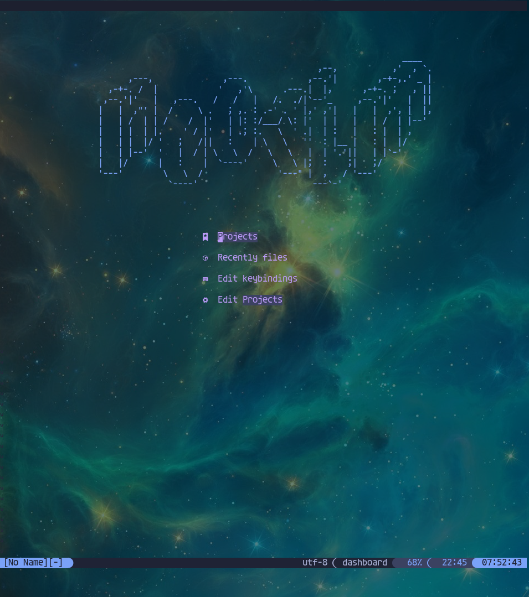
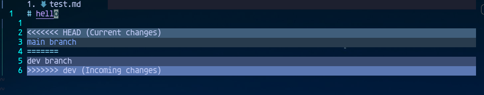

# Modern Neovim Configuration

Neovim + Linux = Your Best Almighty IDE

> This configuration is for linux only, and it's not highly optimized for startup performance.

## Supported Language List

- Rust
- Go
- Ts/Js
- C/C++
- Python
- Shell
- SQL
- Lua
- SystemVerilog

> Common features: lsp、format、autocompletion(custom snippets and source)、debug.

> Not all features has been implemented, but you can easily implement most functions needed.

## Personal Environment

OS: Gentoo

WM: Sway (use vulkan renderer)

Terminal: Alacritty (a GPU-accelerated terminal emulator)

Neovim: V0.8+ (build from source with LuaJIT only)

## QuickStart

> It's not recommended to copy the entire configuration directly. You need your own configuration and shortcuts. It's better to find the plugins you are interested in and refer to their configuration.

1. Install `packer.nvim`

```sh
git clone --depth 1 https://github.com/wbthomason/packer.nvim ~/.local/share/nvim/site/pack/packer/start/packer.nvim
```

2. Install `nodejs`, `go`, `rust` for `mason.nvim` and `nvim-treesitter`. If you want to use `fcitx.nvim`, install `fcitx5` first, or you need to remove this plugin from `lua/plugins.lua`.

3. `git clone https://github.com/niuiic/modern-neovim-configuration ~/.config/nvim`

4. `cd ~/.config/nvim && mv init.lua init.luabp`, then create a new `init.lua`.

```lua
require('packer').startup({
    function(use)
        use("wbthomason/packer.nvim")
        use("folke/which-key.nvim")
    end
})
```

5. Use `:PackerSync` to install `which-key.nvim`.

6. Modify `init.lua`.

```lua
require("plugins")
```

7. Use `:PackerSync` to install remaining plugins.

8. `mv init.luabp init.lua`.

9. Install lsps, formatters, lints, daps with `mason.nvim`. Check `lua/plugin/mason.lua` for details.

10. Use `:checkhealth` to check if something is missing.

11. Look for specific functions in `lua/plugins.lua`.

## Keymap

`which-key.nvim` will tell you. You can also check `lua/plugin/*` and `lua/keymap.lua` for details.

> leader: `\`

> localLeader: `<space>`

## LSP

Create a `lspname.lua` in `lua/lsp`, edit the file in the same way as other files.

Modify the `lspList` in `lua/lsp/init.lua`.

> You can install most of the lsps with `mason.nvim`.

## Formatter

Check formatter setting in `lua/plugin/null-ls.lua`. Look for more formatters on [null-ls buildin formatters](https://github.com/jose-elias-alvarez/null-ls.nvim/tree/main/lua/null-ls/builtins/formatting).

## DAP

Create a `dapname.lua` in `lua/debugger`, edit the file in the same way as other files.

Modify the `debuggerList` in `lua/debugger/init.lua`.

> You can install most of the daps with `mason.nvim`.

## Custom Snippets and Sources

Create a `filetype.lua` in `lua/snippet` or `lua/source`, edit the file in the same way as other files.

Modify the `langList` in `lua/snippet/init.lua` or `lua/source/init.lua`.

> [Snippet examples](https://github.com/L3MON4D3/LuaSnip/blob/master/Examples/snippets.lua) and [snippet document](https://github.com/L3MON4D3/LuaSnip/blob/master/DOC.md) may help you.

## Known Issues

- `<C-o>` may not return to correct position.
- Some completion sources and the status line plugin may crash for unknown reasons.

## Screenshot

### Full Screen


### Status Line


### Buffer Line


### Diagnostic


### Fuzzy Finder

Search files, tags, buffers, history files, marks, projects, git status, etc.


### AutoComplete CMD


### Rename


### Go to Reference


### Keymap Suggestion


### Code AutoComplete


### Inner Terminal


### Todo Comments


### File Tree


### Undo Tree


### Dashboard



### Translate


### Unit Test


### Async Tasks


### Indentation Guides


### Yank History


### Code Action


### Colorful Brackets


### Debug


### View Git Diff


### Git Signs


### Document


### Sql


### Quick Motion


### Expand Expression


### TagBar


### Lsp Progress


### Code Context


### Fold


### Colorizer


### Session


### Quickfix


### Startup Time


### Run Code Snip


### Lazygit


### Git Conflict


