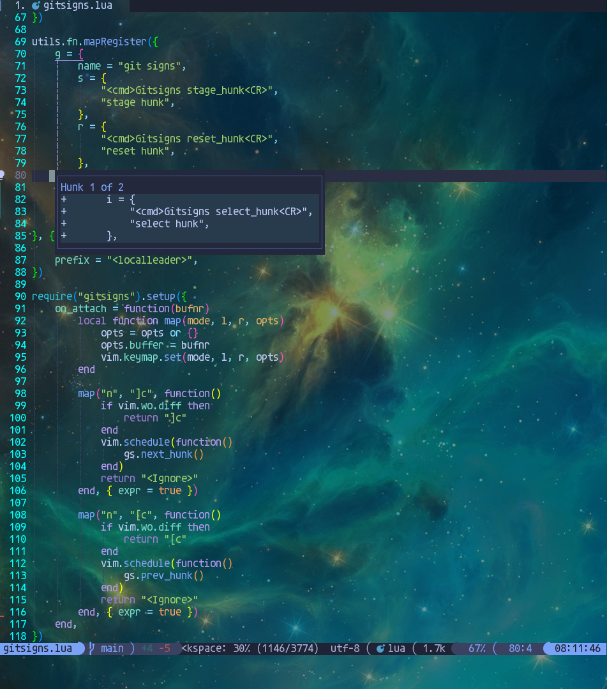
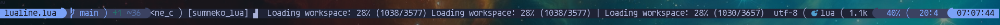
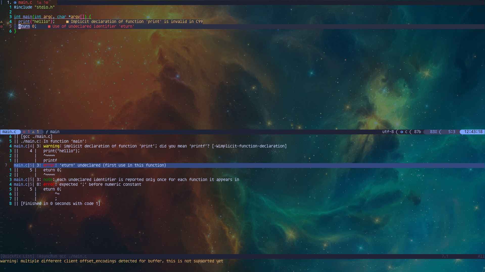
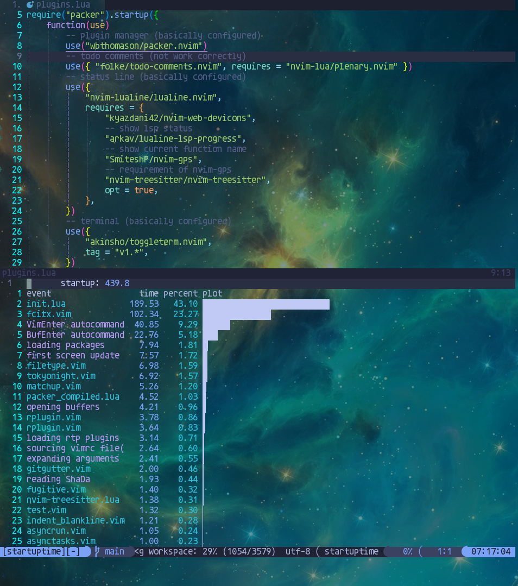
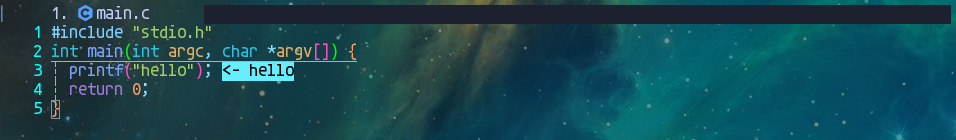
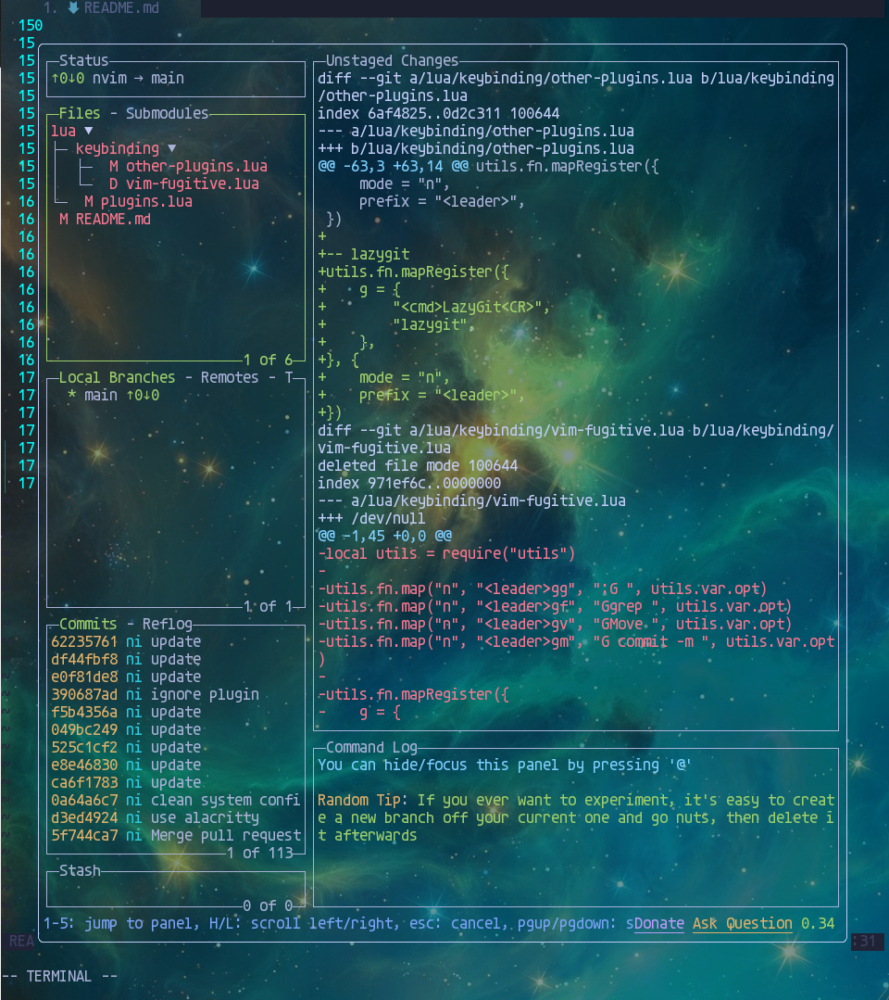

# Modern Neovim Configuration

Modern configuration for neovim.

> It's not highly optimized for startup performance.

## QuickStart

1. install packer.nvim

```sh
git clone --depth 1 https://github.com/wbthomason/packer.nvim ~/.local/share/nvim/site/pack/packer/start/packer.nvim
```

2. `mv init.lua init.luabp`, then create a new `init.lua`.

```lua
vim.cmd [[packadd packer.nvim]]
require('packer').startup({
    function(use)
        use 'liuchengxu/vim-which-key'
    end
})
```

3. use `:PackerSync` to install `vim-which-key`.

4. `mv init.luabp init.lua`

5. use `:PackerSync` to install remaining plugins.

6. use `:checkhealth` to check if something is missing.

7. Look for specific functions in `lua/plugins.lua`.

> It's not recommended to copy the entire configuration directly. You need your own configuration and shortcuts. It's better to find the plugins you are interested in and refer to their configuration.

## Environment

OS: Gentoo

WM: Sway (use vulkan renderer)

Terminal: Alacritty (a GPU-accelerated terminal emulator)

Neovim: V0.8+ (build from source with LuaJIT only)

## Screenshot

### Full Screen


### Status Line


### Buffer Line


### Diagnostic


### Fuzzy Finder

Search files in workspace, tags, buffers, history files, marks, projects, quickfix, git status, etc.


### AutoComplete CMD


### Rename


### Go to Reference


### Keymap Suggestion


### Code AutoComplete


### Inner Terminal


### Todo Comments


### File Tree


### Undo Tree


### Starter


### Translate


### Unit Test


### Async Tasks


### Indentation Guides


### Yank History


### Code Action


### Colorful Brackets


### Debug


### View Git Diff


### Git Signs



### Document


### Sql


### Quick Motion


### Expand Expression


### TagBar


### Lsp Progress



### Code Context


### Fold


### Colorizer


### Session


### Quickfix



### Startup Time



### Run Code Snip



### Lazygit


