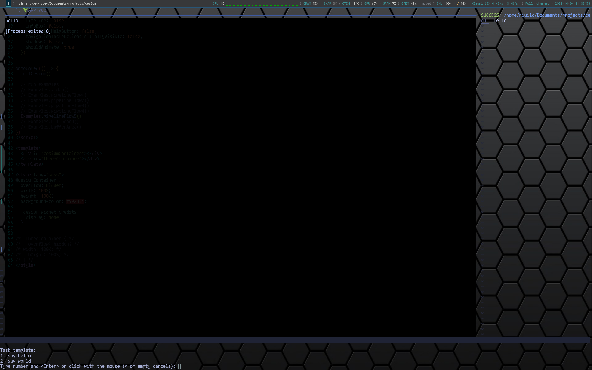
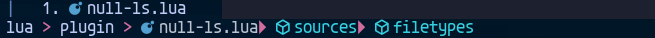
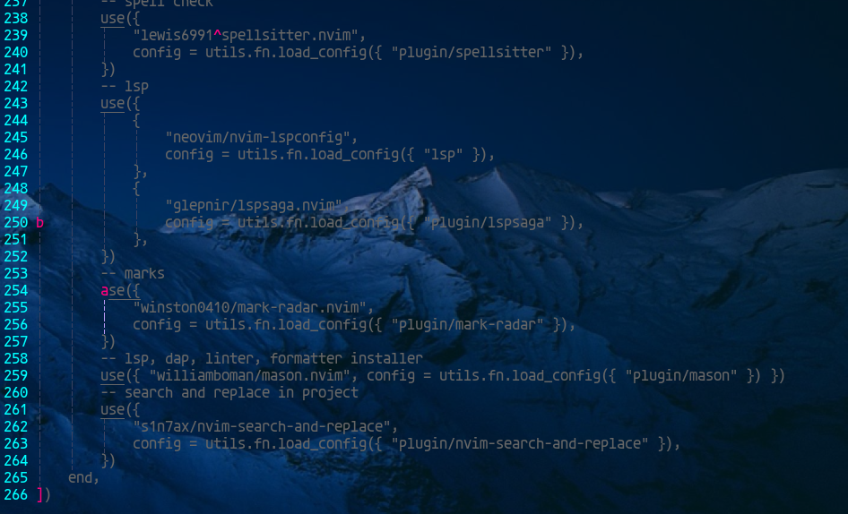
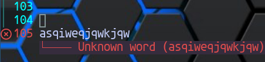

# Modern Neovim Configuration

Neovim + Linux = Your Best Almighty IDE

> This configuration is for linux only, and it's not highly optimized for startup performance.

## Supported Language List

- Rust
- Go
- Ts/Js
- C/C++
- Python
- Shell
- SQL
- Lua
- SystemVerilog
- GLSL
- WGSL

> Common features: lsp、format、autocompletion(custom snippets and source)、debug.

> Not all features has been implemented, but you can easily implement most functions needed.

## Personal Environment

OS: Gentoo

WM: I3

Terminal: Alacritty (a GPU-accelerated terminal emulator)

Neovim: V0.8+ (build from source with LuaJIT only)

## QuickStart

> It's not recommended to copy the entire configuration directly. You need your own configuration and shortcuts. It's better to find the plugins you are interested in and refer to their configuration.

### Installation

1. Install `packer.nvim`

```sh
git clone --depth 1 https://github.com/wbthomason/packer.nvim ~/.local/share/nvim/site/pack/packer/start/packer.nvim
```

2. Install `nodejs`, `go`, `rust` for `mason.nvim` and `nvim-treesitter` (use `:h mason-requirements` to check more requirements). If you want to use `fcitx.nvim`, install `fcitx5` first, or you need to remove this plugin from `lua/plugins.lua`.

3. `git clone https://github.com/niuiic/modern-neovim-configuration ~/.config/nvim`

4. `cd ~/.config/nvim && mv init.lua init.luabp`, then create a new `init.lua`.

```lua
require('packer').startup({
    function(use)
        use("wbthomason/packer.nvim")
        use("folke/which-key.nvim")
    end
})
```

5. Use `:PackerSync` to install `which-key.nvim`.

6. Modify `init.lua` and `lua/utils.lua`.

```lua
-- init.lua
require("plugins")
```

```lua
-- lua/utils.lua

-- disable this function is enough
M.fn.load_config = function(configs)
	-- for _, value in pairs(configs) do
	-- 	local status, _ = pcall(require, value)
	-- 	if not status then
	-- 		print("Error: failed to load config " .. value)
	-- 	end
	-- end
end
```

7. Use `:PackerSync` to install remaining plugins.

8. `mv init.luabp init.lua`. Restore `lua/utils.lua`

9. Install lsps, formatters, lints, daps with `mason.nvim`. Check `lua/plugin/mason.lua` for details.

10. Use `:checkhealth` to check if something is missing.

11. Look for specific functions in `lua/plugins.lua`.

### Keymap

`which-key.nvim` will tell you. You can also check `lua/plugin/*` and `lua/keymap.lua` for details.

> leader: `\`

> localLeader: `<space>`

### LSP

Create a `lspname.lua` in `lua/lsp`, edit the file in the same way as other files.

Modify the `lspList` in `lua/lsp/init.lua`.

### Formatter

Check formatter setting in `lua/plugin/null-ls.lua`. Look for more formatters on [null-ls buildin formatters](https://github.com/jose-elias-alvarez/null-ls.nvim/tree/main/lua/null-ls/builtins/formatting).

### DAP

Create a `dapname.lua` in `lua/debugger`, edit the file in the same way as other files.

Modify the `debuggerList` in `lua/debugger/init.lua`.

### Custom Snippets and Sources

Create a `filetype.lua` in `lua/snippet` or `lua/source`, edit the file in the same way as other files.

Modify the `langList` in `lua/snippet/init.lua` or `lua/source/init.lua`.

> [Snippet examples](https://github.com/L3MON4D3/LuaSnip/blob/master/Examples/snippets.lua) and [snippet document](https://github.com/L3MON4D3/LuaSnip/blob/master/DOC.md) may help you.

### Config for Workspace

The root path of a workspace is where `.git` located. `$rootPath/.nvim/init.lua` is the entry of the local configuration.

### Tasks

[overseer.nvim](https://github.com/stevearc/overseer.nvim) is used to manage tasks. Here is the recommended way to define tasks.

1. Create `.nvim/task/` under the root path of the project.
2. Edit tasks in `.nvim/task/task.sh` and `.nvim/task/init.lua`.

`.nvim/task/init.lua`

```lua
local utils = require("utils")

local overseer = utils.fn.require("overseer")

local scriptPath = utils.fn.root_pattern() .. "/.nvim/task/task.sh"

overseer.register_template({
	name = "Test",
	builder = function()
		return {
			cmd = { scriptPath },
			args = { "hello" },
		}
	end,
})
```

`.nvim/task/task.sh`

```sh
if [ "$1" = "hello" ]; then
	echo 'hello'
fi
```

3. `chmod +x .nvim/task/task.sh`
4. Require `.nvim/task/init.lua` in `.nvim/init.lua`.

`.nvim/init.lua`

```lua
local utils = require("utils")

package.path = debug.getinfo(1, "S").source:match([[^@?(.*[\/])[^\/]-$]]) .. "?.lua;" .. package.path

utils.fn.require("task")
```

## Known Issues

- `<C-o>` may not return to correct position.
- Some completion sources and the status line plugin may crash for unknown reasons.
- Code folding may be misplaced after re-entering the file.

## FAQ

- GLSL syntax diagnostics not working

`glslangValidator` requires files to have a specific suffix, check [document](https://github.com/KhronosGroup/glslang#execution-of-standalone-wrapper) for details.

## Showcase

Some functions are not convenient to display with pictures, please check `lua/plugins.lua`.

<details>
  <summary><b>Full Screen</b></summary>

</details>

<details>
  <summary><b>Status Line</b></summary>

</details>

<details>
  <summary><b>Buffer Line</b></summary>

</details>

<details>
  <summary><b><b>Diagnostic</b></b></summary>

</details>

<details>
  <summary><b>Fuzzy Finder</b></summary>
Search files, tags, buffers, history files, marks, projects, git status, etc.

</details>

<details>
  <summary><b>AutoComplete CMD</b></summary>

</details>

<details>
  <summary><b>Rename</b></summary>

</details>

<details>
  <summary><b>Go to Reference</b></summary>

</details>

<details>
  <summary><b>Keymap Suggestion</b></summary>

</details>

<details>
  <summary><b>Code AutoComplete</b></summary>

</details>

<details>
  <summary><b>Inner Terminal</b></summary>

</details>

<details>
  <summary><b>Todo Comments</b></summary>

</details>

<details>
  <summary><b>File Tree</b></summary>

</details>

<details>
  <summary><b>Undo Tree</b></summary>

</details>

<details>
  <summary><b>Dashboard</b></summary>

</details>

<details>
  <summary><b>Translate</b></summary>

</details>

<details>
  <summary><b>Unit Test</b></summary>

</details>

<details>
  <summary><b>Tasks</b></summary>

</details>

<details>
  <summary><b>Indentation Guides</b></summary>

</details>

<details>
  <summary><b>Yank History</b></summary>

</details>

<details>
  <summary><b>Code Action</b></summary>

</details>

<details>
  <summary><b>Colorful Brackets</b></summary>

</details>

<details>
  <summary><b>Debug</b></summary>

</details>

<details>
  <summary><b>View Git Diff</b></summary>

</details>

<details>
  <summary><b>Git Signs</b></summary>

</details>

<details>
  <summary><b>Document</b></summary>

</details>

<details>
  <summary><b>Sql</b></summary>

</details>

<details>
  <summary><b>Quick Motion</b></summary>

</details>

<details>
  <summary><b>Expand Expression</b></summary>

</details>

<details>
  <summary><b>TagBar</b></summary>

</details>

<details>
  <summary><b>Lsp Progress</b></summary>

</details>

<details>
  <summary><b>Symbol Winbar</b></summary>

</details>

<details>
  <summary><b>Fold</b></summary>

</details>

<details>
  <summary><b>Colorizer</b></summary>

</details>

<details>
  <summary><b>Session</b></summary>

</details>

<details>
  <summary><b>Quickfix</b></summary>

</details>

<details>
  <summary><b>Startup Time</b></summary>

</details>

<details>
  <summary><b>Run Code Snip</b></summary>

</details>

<details>
  <summary><b>Lazygit</b></summary>

</details>

<details>
  <summary><b>Git Conflict</b></summary>

</details>

<details>
  <summary><b>Show Marks</b></summary>

</details>

<details>
  <summary><b>Spell Check</b></summary>

</details>
